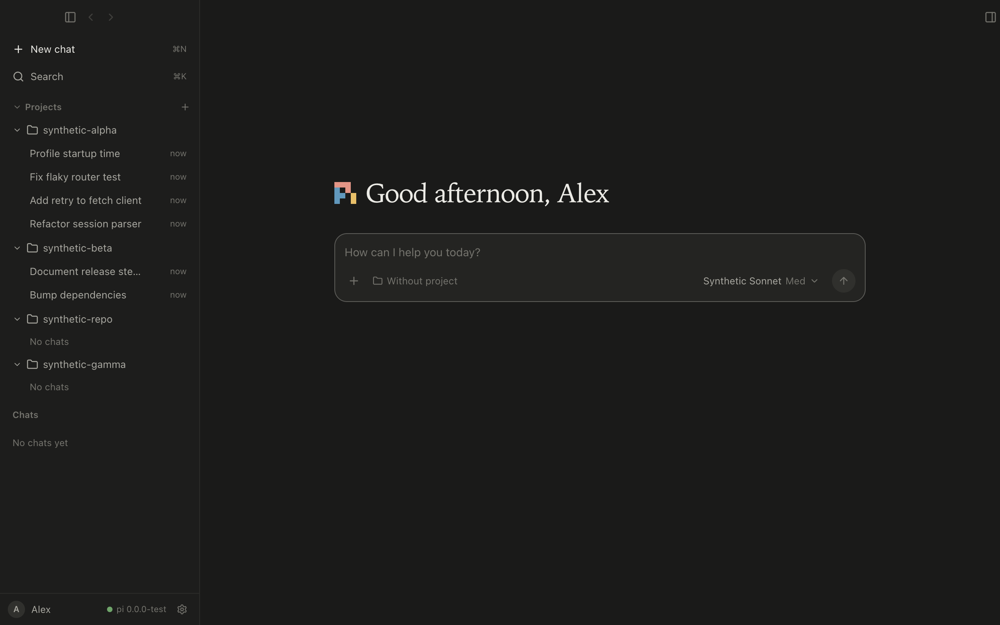
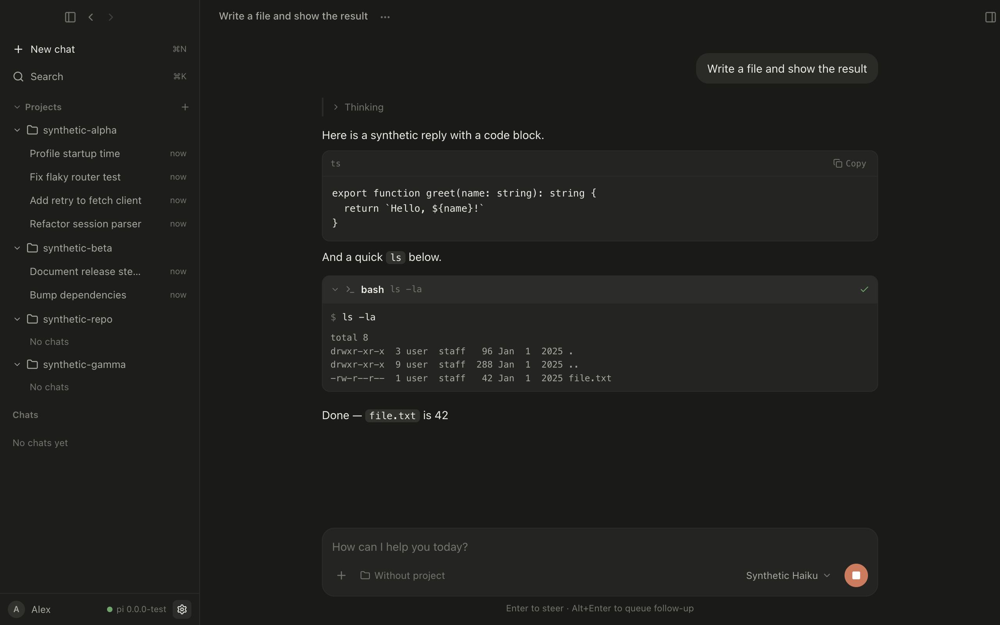
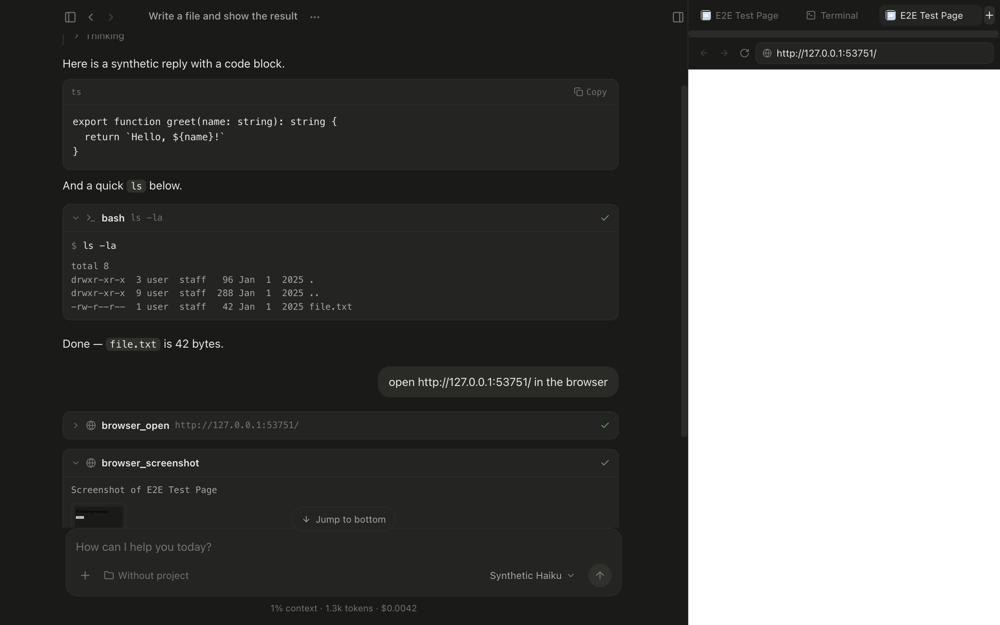

# Pi Desktop

An open-source desktop GUI for the [pi](https://pi.dev) coding agent.

Pi Desktop is a shell: the actual agent is `pi` itself, running in the
background as `pi --mode rpc` (JSONL over stdin/stdout). It reuses your
existing pi data in `~/.pi/agent` — settings, models, auth, sessions,
extensions and skills — so chats you start in the app remain fully
compatible with the pi TUI (`pi -r`, `pi --session`) and vice versa.



## Features

- **One window, all your pi chats** — sessions are indexed, grouped by
  project and date, searchable, and shared with the pi TUI.
- **Full chat engine** — streaming replies, thinking blocks, markdown with
  syntax highlighting, tool cards (bash/read/edit/write with diffs),
  retry and compaction notices, stop / steer / follow-up controls.
- **Model & thinking-level picker** — live catalog from pi
  (`get_available_models`), grouped by provider.
- **Slash commands** — pi's skills, prompt templates and extension
  commands, plus app commands like `/new`, `/name`, `/compact`,
  `/export`, `/model` and `/thinking`.
- **Session management** — rename, export to HTML, reveal in Finder, copy
  path, move to Trash, fork from any user message, and clone a chat.
- **Projects and chats** — sessions nest under their project folder;
  project-less chats run in an app-owned scratch workspace.
- **Side panel** — browser tabs, a real terminal (`node-pty` + xterm) and
  a live git diff view for the chat's project, toggled with ⌘⌥B.
- **Agent browser** — pi can drive the in-app browser itself through an
  extension that ships with the app: `browser_open`, `browser_click`,
  `browser_screenshot` and friends, backed by Chrome DevTools Protocol.
- **Runtime flexibility** — uses your installed `pi`, the bundled pinned
  `@earendil-works/pi-coding-agent`, or a custom path you choose in
  Settings.
- **Native feel** — warm dark/light themes following the system, native
  menus and dialogs, keyboard shortcuts (⌘N new chat, ⌘B sidebar,
  ⌘[ / ⌘] history, ⌘, settings).





## Install

### Download

Grab the latest `.dmg` (or `.zip`) for Apple Silicon or Intel from
[Releases](https://github.com/azygoss/pi-desktop/releases). Builds are
currently unsigned; on first launch macOS may ask you to confirm opening
an app from an unidentified developer (right-click → Open).

### Build from source

Requirements: macOS, Node.js 22.19+ and [pnpm](https://pnpm.io).

```bash
git clone https://github.com/azygoss/pi-desktop.git
cd pi-desktop
pnpm install
pnpm dist:mac    # release/*.dmg + *.zip (arm64 + x64, unsigned)
# or for a quick unpacked build:
pnpm dist:dir    # release/mac-*/Pi Desktop.app
```

## Requirements

- **pi is optional.** When `pi` is not on `PATH`, Pi Desktop falls back to
  a bundled, pinned pi runtime (see Settings → Pi Runtime to force a mode
  or point at a custom executable).
- **Authentication** is handled by pi itself: run `pi` once in a terminal
  and use `/login`, or configure API keys per the
  [pi docs](https://pi.dev/docs/latest). Pi Desktop never touches
  credentials.

## How it works

```
┌──────────────┐   typed IPC (contextBridge)   ┌──────────────┐
│   Renderer   │◀─────────────────────────────▶│    Main       │
│  React UI    │    window.piDesktop.*         │  Node host    │
└──────────────┘                               └──────┬───────┘
                                                      │ spawn per chat
                                               JSONL over stdio
                                                      ▼
                                              ┌──────────────┐
                                              │ pi --mode rpc│
                                              │ (the agent)  │
                                              └──────────────┘
```

The renderer is fully sandboxed (`contextIsolation`, `sandbox`, strict
CSP) and only talks to a minimal typed preload API. The main process owns
the pi child processes — one per open chat — and validates every IPC
input. Pi Desktop never re-implements agent logic; models, commands,
sessions, skills and extension UI all come from the real `pi`.

## Privacy

- The app **never reads, parses or displays `auth.json`** or any model
  registry/credential file.
- Session `.jsonl` files are read locally, only to index and display your
  chats.
- Nothing leaves your machine except what the pi agent itself sends to
  its configured model providers.
- Deleting a chat moves the session file to the OS Trash, never `rm`.

## Development

```bash
pnpm install
pnpm dev          # run the app in development
pnpm typecheck    # TypeScript checks (main + renderer)
pnpm lint         # ESLint
pnpm test         # Vitest unit tests
pnpm test:e2e     # Electron e2e against a synthetic fake pi
pnpm build        # production build
pnpm dist:dir     # unpacked .app (quick packaging check)
pnpm dist:mac     # signed-off dmg + zip for macOS
```

`PI_DESKTOP_PI_COMMAND=/path/to/pi` overrides runtime resolution (used by
the e2e fixture and handy for development).

## Contributing

See [CONTRIBUTING.md](CONTRIBUTING.md) and the agent-facing rules in
[AGENTS.md](AGENTS.md). Bug reports are welcome — please don't paste API
keys or session contents into issues.

## Acknowledgements

pi is built by Earendil / Mario Zechner. Pi Desktop is a community
project and is not affiliated with or endorsed by pi. The pi logo used in
the app icon and UI (build/pi-logo.svg, downloaded from
[pi.dev](https://pi.dev/logo.svg)) belongs to Earendil / the pi project and
is used solely to identify pi.

## License

[MIT](LICENSE) — Copyright © 2026 Pi Desktop contributors.
